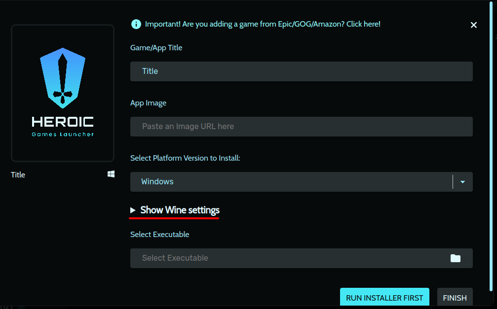
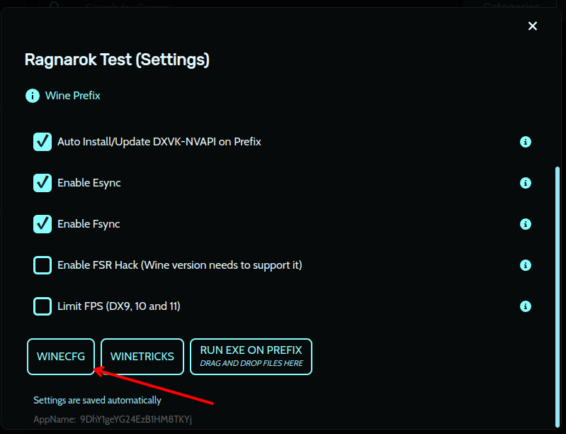

# 🎮 How to Install Ragnarok LATAM on Linux via Proton (using Heroic)

If you want to run **Ragnarok LATAM** on Linux, you can do so perfectly with **Heroic Games Launcher** and **Proton GE**. This step-by-step guide has been tested and works — all thanks to **aleex5**, who discovered this method and shared it with the community.

---

# 🛡️ Heroic

## ✅ Prerequisites

- **Heroic Games Launcher** installed  
  <details>
    <summary>Click to see how to install</summary>

    If you don't have Flatpak installed yet:

    ```bash
    sudo apt install flatpak
    ```

    Add the Flathub repository:

    ```bash
    flatpak remote-add --if-not-exists flathub https://flathub.org/repo/flathub.flatpakrepo
    ```

    Install Heroic:

    ```bash
    flatpak install flathub com.heroicgameslauncher.hgl
    ```

    <div style="background-color:rgba(0, 0, 0, 0.2); border-left: 4px solid #ffcc00; padding: 10px; margin-top: 10px; font-style: italic;">
    The Flatpak version of Heroic Games Launcher is preferable as it ensures quicker updates, better permission control, and superior performance compared to APT or Snap, which may ship outdated versions or carry extra overhead. Also, being the “official” way, it's the one recommended by the developers themselves.
    </div>
  </details>

- **Proton GE** (Proton GloriousEggroll)

## 📥 Installing Proton GE in Heroic

1. Open **Heroic Games Launcher**  
2. Go to `Settings` → `Wine Manager`

   

3. In the **Proton-GE** tab, download **GE-Proton9-27**  
   (Newer versions may also work)

   

## 🎮 Installing Ragnarok in Heroic

1. In Heroic, click **ADD GAME**

   

2. Fill in the **Game/App Name** field with **Ragnarok**  
   (Heroic will auto-load the image — optional)

   

3. Expand **Show Wine Settings**

   

4. Select **GE-Proton9-27** under **Wine Version**

   

5. Click **Run Installer First**  
   (Important: choose Proton **before** running the `.exe`)

   

6. Select the **Ragnarok LATAM `.exe` installer** you downloaded

   

7. Run the installer as usual

   

8. After installing, locate the game executable:

   

   - Default path:  
     `~/path/to/prefix/Prefixes/default/Ragnarok/pfx/drive_c/Gravity/Ragnarok/Ragnarok.exe`

   

9. Finish setup

## ⚙️ Wine (Proton) Configuration

1. In Heroic, go to the **game settings**

   

2. Click **Wine Config (winecfg)**

   

3. In the **Applications** tab, click **Add application...** and select `Ragexe.exe` from the path `Gravity/Ragnarok/Ragexe.exe`

     
   

4. With `Ragexe.exe` selected, set compatibility mode to **Windows 7**

   

5. Click **Apply** and then **OK**

### 📝 Optional Steps

1. Install Windows fonts via **Winetricks**

   

2. Install the `corefonts` package

   

<div style="background-color:rgba(0, 0, 0, 0.2); border-left: 4px solid #ffcc00; padding: 10px; margin-top: 10px; font-style: italic;">
  <b>Important:</b>  
  Some users reported that removing `dbghelp.dll` from the `system32` folder fixed some issues with the game. Try it if you face problems!
</div>

## 🚀 Running Ragnarok

Now you can launch the game normally from Heroic.  
If everything is set up correctly, Ragnarok will open and run without issues!

## 🙌 Credits

Special thanks to **@aleex5**, who discovered and shared this setup with the community — helping all the Linux folks relive this classic!
