# 🎮 Cómo Instalar Ragnarok LATAM en Linux vía Proton (usando Heroic)

Si deseas ejecutar **Ragnarok LATAM** en Linux, puedes hacerlo perfectamente con **Heroic Games Launcher** y **Proton GE**. Esta guía ha sido probada y funciona — todo gracias a **aleex5**, quien descubrió este método y lo compartió con la comunidad.

---

# 🛡️ Heroic

## ✅ Requisitos Previos

- **Heroic Games Launcher** instalado  
  <details>
    <summary>Haz clic para ver cómo instalar</summary>

    Si aún no tienes Flatpak instalado:

    ```bash
    sudo apt install flatpak
    ```

    Agrega el repositorio de Flathub:

    ```bash
    flatpak remote-add --if-not-exists flathub https://flathub.org/repo/flathub.flatpakrepo
    ```

    Instala Heroic:

    ```bash
    flatpak install flathub com.heroicgameslauncher.hgl
    ```

    <div style="background-color:rgba(0, 0, 0, 0.2); border-left: 4px solid #ffcc00; padding: 10px; margin-top: 10px; font-style: italic;">
    La versión Flatpak de Heroic Games Launcher es preferible, ya que garantiza actualizaciones rápidas, mayor control de permisos y un rendimiento superior en comparación con APT y Snap, que pueden tener versiones desactualizadas o sobrecarga de rendimiento. Además, al ser la versión "oficial" de la aplicación, es recomendada por los propios desarrolladores.
    </div>
  </details>

- **Proton GE** (Proton GloriousEggroll)

## 📥 Instalando Proton GE en Heroic

Video que muestra el paso a paso (video hecho por **@aleex5**):

<iframe width="560" height="315" src="https://www.youtube.com/embed/us_t-bfkXUo" 
frameborder="0" allowfullscreen></iframe>

1. Abre **Heroic Games Launcher**  
2. Ve a `Configuraciones` → `Wine Manager`

   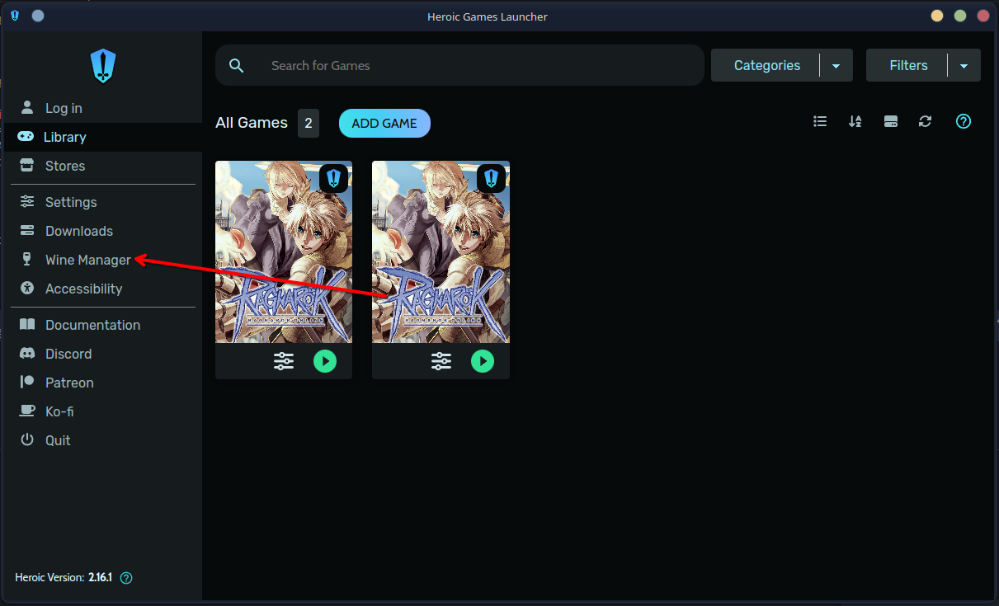

3. En la pestaña **Proton-GE**, descarga la versión **GE-Proton9-27**  
   (Las versiones más nuevas también pueden funcionar)

   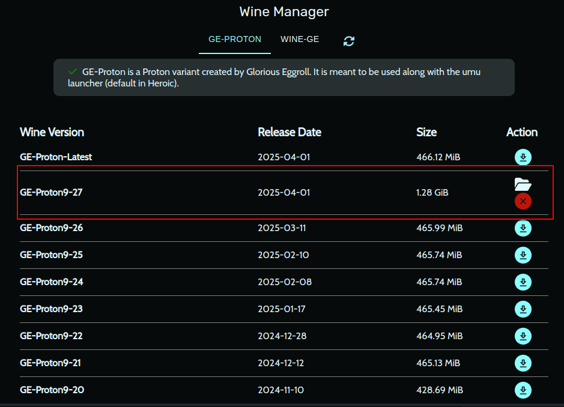

## 🎮 Instalando Ragnarok en Heroic

1. En Heroic, haz clic en **ADD GAME**

   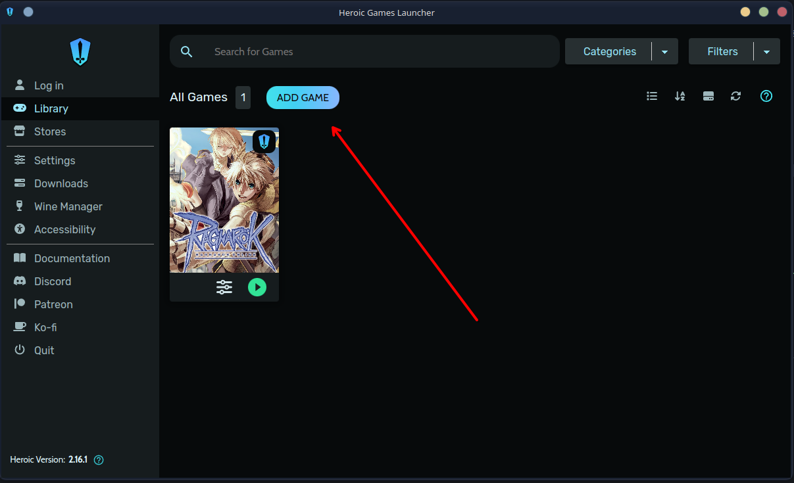

2. Completa el campo **Game/App Name** con **Ragnarok**  
   (Heroic debería cargar la imagen automáticamente — opcional)

   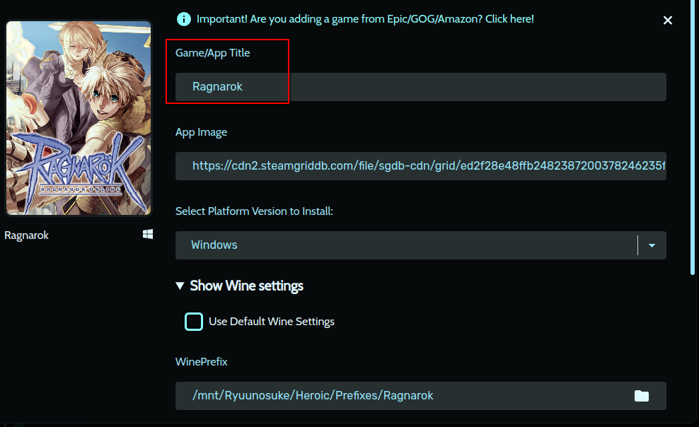

3. Expande la sección **Show Wine Settings**

   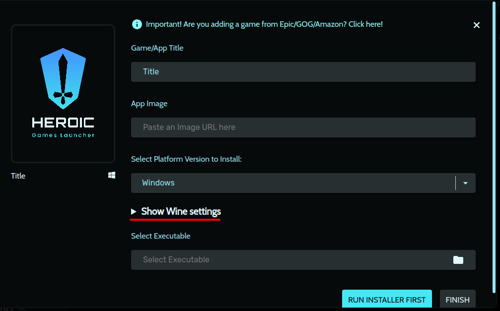

4. Selecciona **GE-Proton9-27** en **Wine Version**

   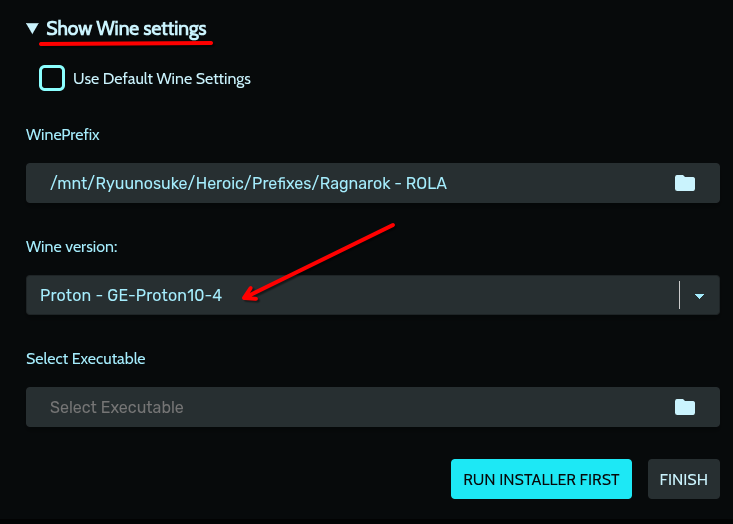

5. Haz clic en **Run Installer First**  
   (Importante: elige Proton **antes** de ejecutar el `.exe`)

   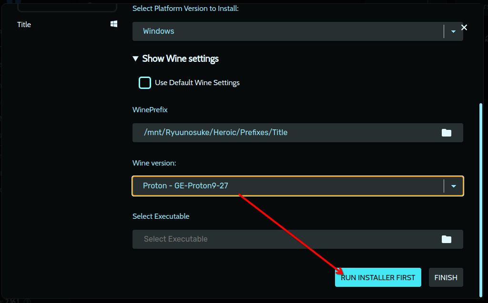

6. Selecciona el instalador `.exe` de **Ragnarok LATAM** que descargaste

   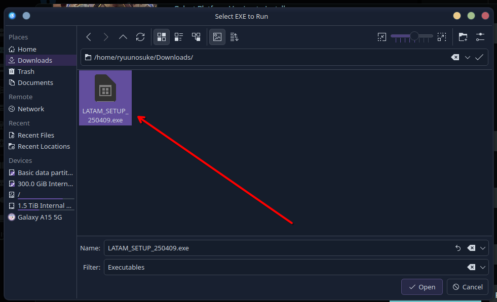

7. Ejecuta el instalador normalmente

   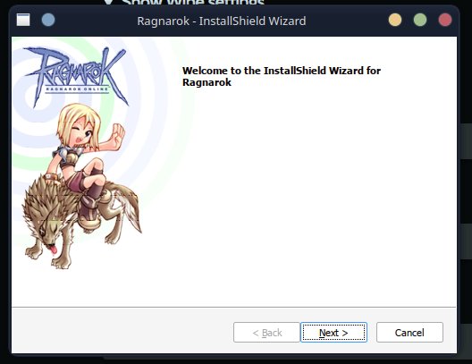

8. Después de la instalación, localiza el ejecutable del juego:

   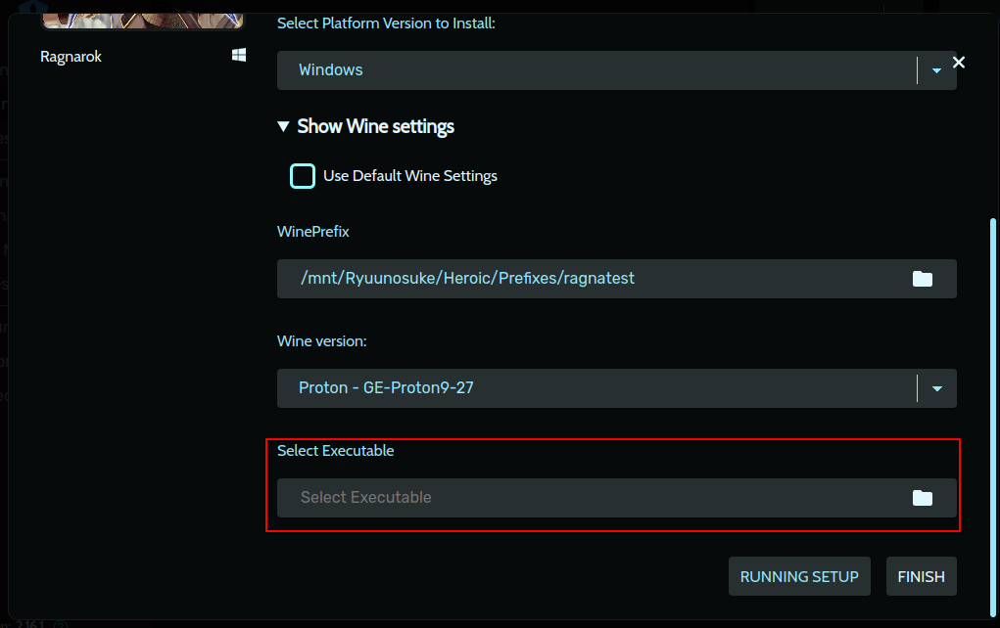

   - Ruta predeterminada:  
     `~/path/to/prefix/Prefixes/default/Ragnarok/pfx/drive_c/Gravity/Ragnarok/Ragnarok.exe`

   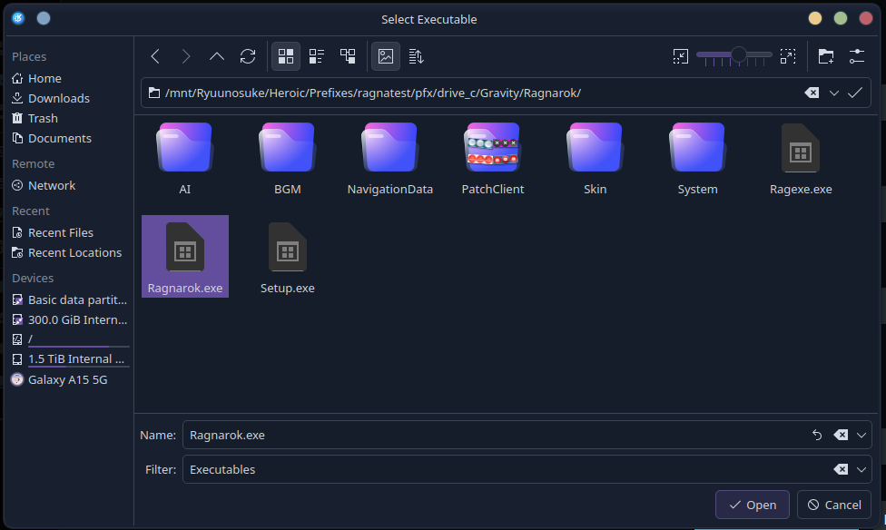

9. Finaliza la instalación

## ⚙️ Configurando Wine (Proton)

1. En Heroic, ve a las **Configuraciones** del juego

   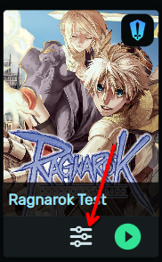

2. Haz clic en **Wine Config (winecfg)**

   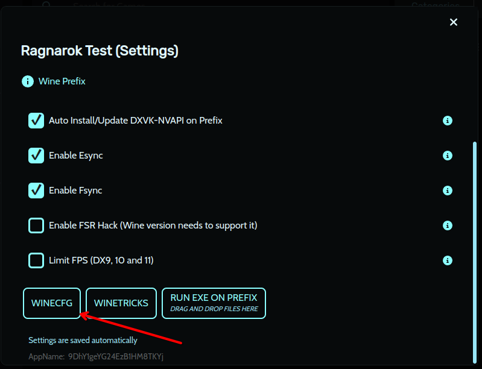

3. En la pestaña **Aplicación**, haz clic en **Add application...** y selecciona `Ragexe.exe` en la ruta `Gravity/Ragnarok/Ragexe.exe`

   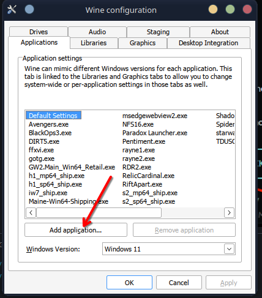  
   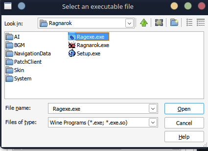

4. Con `Ragexe.exe` seleccionado, establece el modo de compatibilidad como **Windows 7**

   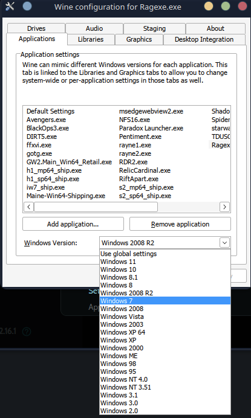

5. Haz clic en **Aplicar** y luego en **OK**

### 📝 Pasos Opcionales

1. Instala las fuentes de Windows haciendo clic en **Winetricks**

   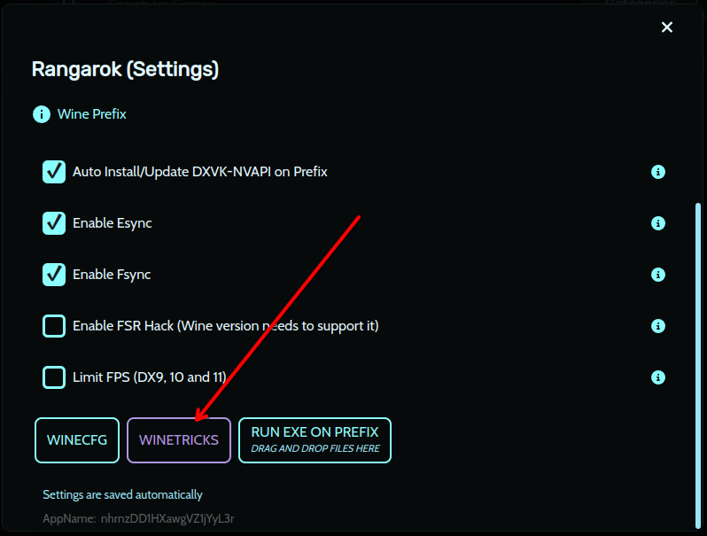

2. Instala el paquete `corefonts`

   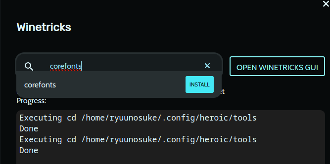

<div style="background-color:rgba(0, 0, 0, 0.2); border-left: 4px solid #ffcc00; padding: 10px; margin-top: 10px; font-style: italic;">
  <b>🚨 Importante:</b>  
  Algunas personas informaron que fue necesario eliminar el archivo <b>dbghelp.dll</b> de la carpeta <b>System32</b> ubicada en <b>~/path/to/prefix/Prefixes/default/Ragnarok/pfx/drive_c/Windows/System32</b> para que el juego funcionara correctamente. ¡Vale la pena intentarlo si algo no funciona!
</div>

6. En Heroic, vuelve a las **Configuraciones** del juego

   

7. Ve a **Other** y selecciona **Use Steam Runtime**

   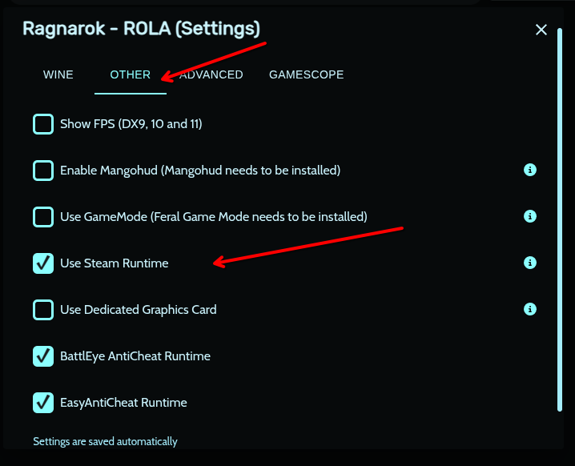

8. Luego ve a **Advanced** y selecciona **Disable UMU**

   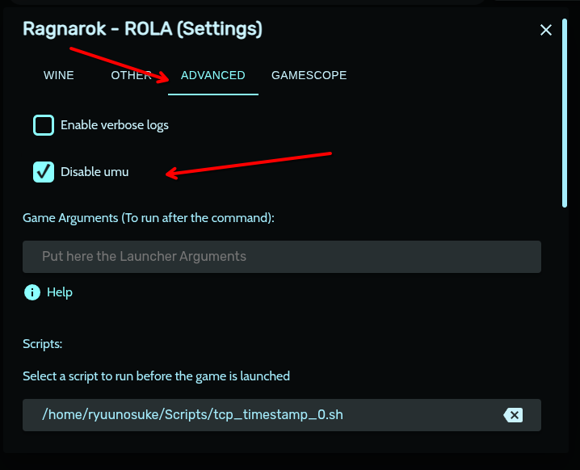


### 🔧 Soluciones Alternativas

En el servidor Nidhogg existe un problema donde la ciudad de **Prontera** se vuelve inaccesible — podrías recibir el error `Desconectado del Servidor` al intentar entrar con un personaje ubicado allí. Para solucionar esto (y posiblemente otros problemas similares en otros mapas o servidores), ejecuta el siguiente comando mientras el juego está abierto:

```bash
   sudo sysctl -w /etc/sysctl.conf
```

Si lo prefieres, puedes hacer que este cambio sea permanente editando el archivo `/etc/sysctl.conf` en tu sistema y añadiendo la línea `/etc/sysctl.conf` al final.

<div style="background-color:rgba(0, 0, 0, 0.2); border-left: 4px solid #ffcc00; padding: 10px; margin-top: 10px; font-style: italic;">
  <b>⚠️ Atención:</b>  
  Aún es un tema en discusión dentro de la comunidad, así que lo mejor por ahora es consultar el servidor de Discord si tienes dudas sobre este paso.
</div>

¡Este workaround fue descubierto por el usuario **@trololobr** en Discord!

## 🚀 Ejecutando Ragnarok

Ahora solo necesitas abrir el juego normalmente desde Heroic.  
¡Si todo está configurado correctamente, Ragnarok se iniciará sin problemas!

---

# 🙌 Agradecimientos
Un agradecimiento especial a **@aleex5**, quien descubrió esta configuración y la compartió con la comunidad — ¡salvando a la comunidad de Linux que quería revivir este clásico!

---

# 🤝 Contribución

Para contribuir, solo necesitas crear un PR en el siguiente repositorio: https://github.com/RyuunosukeDS3/ragnarok-latam-linux-guide.
